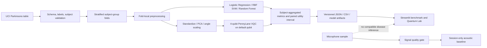

# SustainX.Q

**SustainX.Q is an AI-assisted research screening prototype — NOT a medical diagnosis.** This project is an exploratory implementation for Smart India Hackathon 2026 Problem Statement 26139, “Hybrid Quantum Machine Learning Platform for Early Disease Detection.” It investigates Parkinson's voice screening using a real public dataset and compares classical models with a small hybrid quantum-classical model.

It is not clinically validated. Do not use it to diagnose, treat, or rule out a condition. It does not demonstrate quantum advantage or real-world clinical accuracy.

## What It Does

- Downloads and validates UCI's Parkinsons engineered voice-feature dataset.
- Evaluates Logistic Regression, RBF SVM, Random Forest, and a PennyLane variational quantum classifier on subject-disjoint folds.
- Uses training-fold-only preprocessing and a compact PCA bottleneck for the quantum circuit.
- Calculates metrics from actual out-of-fold predictions and estimates quantum utility with a paired subject bootstrap.
- Provides microphone recording-quality checks and an optional session-only personal acoustic baseline.
- Keeps microphone measurements separate from the UCI model. Live microphone disease inference is **unavailable** because compatible feature extraction has not been demonstrated.
- Shows held-out permutation importance for classical models and the quantum circuit configuration, without causal claims.

Parkinson's Disease is the only active research module. Alzheimer's/MCI, depression, stroke aftermath/recovery, ALS, essential tremor, and fall risk are experimental/future research extensions with no validated prediction models or scores in this MVP. Skin Lesion Screening is a planned future update and is not currently implemented.

## Research Roadmap

- **Phase 1 — Current MVP:** Parkinson's voice screening research pipeline, classical ML benchmarks, hybrid quantum-classical benchmark, explainability, personal baseline, and recording quality assessment.
- **Phase 2 — Neurological extensions:** Alzheimer's/MCI, depression, stroke-related signals, ALS, essential tremor, and fall risk. These are not validated clinical screening tools.
- **Phase 3 — Multimodal research:** voice, handwriting, typing rhythm, gait, and multimodal feature fusion.
- **Future Updates:** Skin Lesion Screening is planned to explore image features and questionnaire-based signals. It is not currently implemented and has no model or prediction results.

## Architecture



## Setup

Requires Python 3.11 and an internet connection for the first UCI download.

Windows PowerShell:

```powershell
py -3.11 -m venv .venv
.\.venv\Scripts\python.exe -m pip install -r requirements-dev.txt
.\.venv\Scripts\python.exe -m pytest -q
```

Run the app:

```powershell
.\.venv\Scripts\streamlit.exe run app.py
```

The Model Benchmark page can run the full experiment. To run it from a terminal instead:

```powershell
.\.venv\Scripts\python.exe -m training.run_benchmark --folds 5 --qubits 4 --layers 2 --epochs 15
```

The first run downloads the public CSV to ignored `data/parkinsons.data`. Generated measured reports, out-of-fold predictions, and research model bundles are saved under `artifacts/`. Training is not run automatically on app startup. The benchmark action may take a few minutes; avoid repeating it unless you intend to regenerate results.

## Dataset

Source: [UCI Parkinsons dataset](https://archive.ics.uci.edu/dataset/174/parkinsons), DOI [10.24432/C59C74](https://doi.org/10.24432/C59C74), CC BY 4.0. The source provides 22 engineered measurements per recording, a recording/person identifier, and binary status.

The UCI page describes 195 recordings from 31 people (23 with Parkinson's), while its headline lists 197 instances. The downloaded CSV validated in this environment has 195 rows, 22 numeric features, no missing values, and 32 subject IDs: 8 healthy and 24 Parkinson's participants. The source checksum is recorded in `artifacts/benchmark.json`. The app reports validated file counts and surfaces this discrepancy rather than altering labels or rows. See [data/README.md](data/README.md).

## Training And Evaluation

The evaluation uses five-fold stratified group cross-validation. The `name` column is parsed to a subject ID and excluded, along with `status`, from model features. All recordings from one person remain within one fold. Imputation, scaling, and PCA are fit only on training-fold records; held-out records only pass through those fitted transforms.

Classical models are Logistic Regression, an RBF SVM, and a 250-tree Random Forest. The SVM uses an uncalibrated decision score rescaled monotonically for metric calculation; this is not a probability. The quantum model uses a 4-qubit PennyLane `default.qubit` statevector simulator, Y-angle embedding, two shallow strongly entangling layers, Adam optimization, and four training-fold PCA components scaled to `[-pi, pi]`. The UI can rerun with 4, 6, or 8 qubits and 5, 10, or 15 epochs; only measured configurations produce output.

Metrics are calculated after averaging each person's out-of-fold recording scores: accuracy, sensitivity, specificity, precision, F1, and ROC-AUC. The dashboard also shows per-fold mean and standard deviation, training time, and inference time. Small fold counts mean high uncertainty; a fold can have very few healthy participants. The reports are exploratory, not an independent external validation. No probability calibration is claimed.

Quantum Utility compares paired subject-level out-of-fold ROC-AUC against the RBF SVM, using a pre-set 0.05 practical margin and class-stratified bootstrap interval. The label is calculated from observed outputs: “Measurable benefit observed,” “No measurable benefit observed,” or “Insufficient evidence.” It does not establish quantum advantage; this is a small simulator experiment on a classical computer.

Held-out permutation importance describes which features affect classical model performance on these folds. It is not causal or biological evidence. The quantum explanation is limited to selected PCA components, encoding, circuit configuration, and comparative results.

## Voice, Baseline, And Privacy

The microphone workflow checks duration, sample rate, signal level, clipping, silence, and an energy-based activity proxy. The proxy is not speech recognition. A failed quality gate blocks baseline entry. The app does not save raw recording bytes to persistent storage or send them to external AI services. Audio handling occurs during the Streamlit session, and derived measurements remain in temporary app-session state unless the user exports them.

The baseline is a small set of numerical acoustic measurements and timestamps held in session state, not browser persistent storage. Users can export/import JSON or delete the session baseline. It is descriptive only: a person's baseline can itself be atypical and must not be interpreted as disease progression.

The UCI dataset contains engineered measurements rather than the raw microphone recordings. The app therefore does not display a disease score for microphone input. Feature compatibility must be demonstrated on suitable labeled audio before enabling that path.

## Deployment

This is a standard Streamlit app with no secrets or personal-machine paths. For Streamlit Community Cloud:

1. Push the repository to a GitHub repository you control.
2. Create a Community Cloud app pointing to `app.py` and the default branch.
3. Use `requirements.txt` as the dependency file. No secrets are needed.
4. Allow the first benchmark run to download the UCI CSV. Review the host's memory/runtime limits before selecting 6 or 8 qubits.
5. Verify microphone permission, benchmark execution, and page behavior on the deployed URL.

The current environment has not authenticated or deployed to a public host; public deployment must be completed and tested by the repository owner. Local run command is documented above.

## Project Layout

- `app.py`: Streamlit navigation, quality workflow, baseline, benchmark dashboard, Quantum Lab, explanation, and methodology.
- `src/data.py`: source download, schema and subject validation, checksum and data profile.
- `src/benchmark.py`: leakage-safe folds, classical models, out-of-fold metrics, permutation importance, and utility assessment.
- `src/quantum.py`: fold-local PCA/angle bottleneck and variational circuit training/evaluation.
- `src/quality.py`, `src/baseline.py`: microphone signal assessment and descriptive session baseline logic.
- `src/experiment.py`, `src/artifacts.py`: generated experiment report and full-data research model bundles.
- `training/run_benchmark.py`: reproducible command-line training entry point.
- `tests/`: data, leakage, metrics, audio, baseline, utility, and quantum smoke tests.
- `docs/`: limitations, architecture, and future roadmap.

## Limitations And Roadmap

- Only 32 independent subjects are present in the downloaded file. Performance estimates can vary sharply by fold and do not establish generalization or clinical performance.
- The dataset's published subject count conflicts with the validated CSV. Preserve both facts in any presentation.
- The quantum model is small, simulator-based, and not a speedup demonstration. No noise experiment is implemented in this MVP.
- Calibration, external validation, raw-audio model compatibility, browser-persistent baseline storage, account management, and clinical governance are out of scope.
- Future research may evaluate Alzheimer's/MCI, depression, other signals, and hardware/noise settings only after suitable validated datasets and protocols are available.
